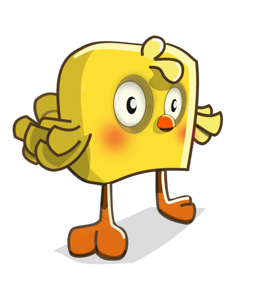
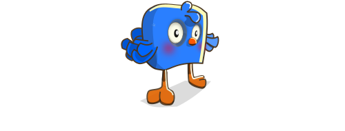
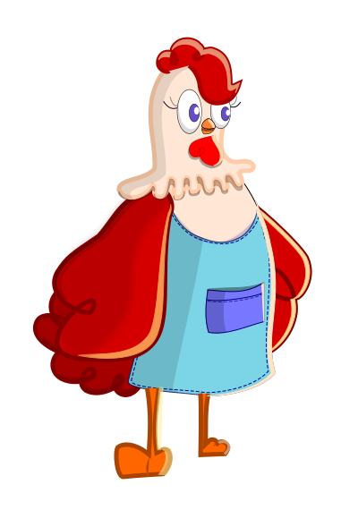
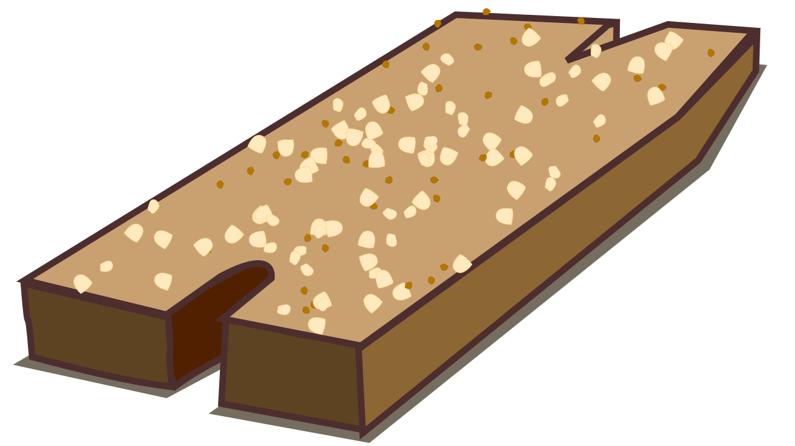
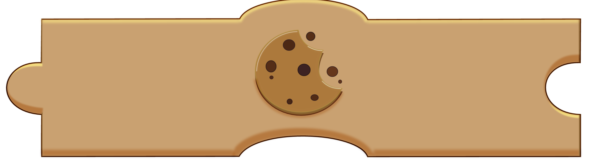
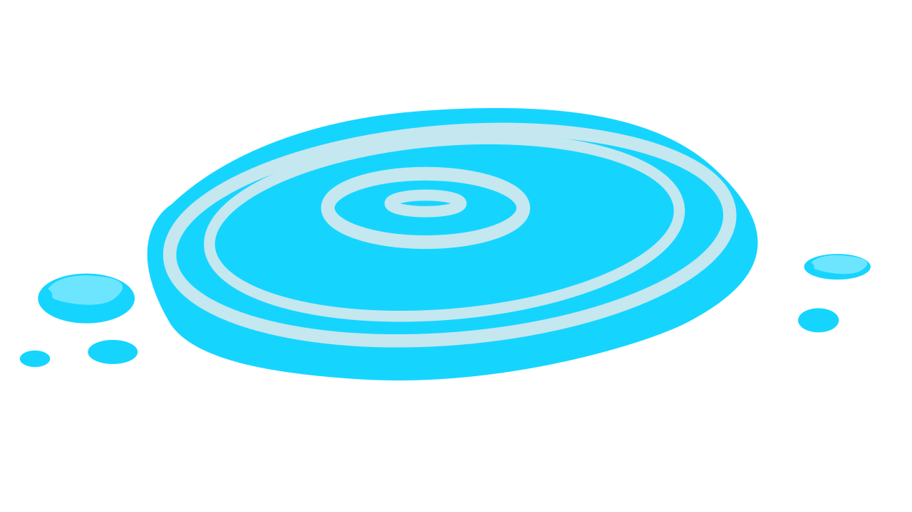
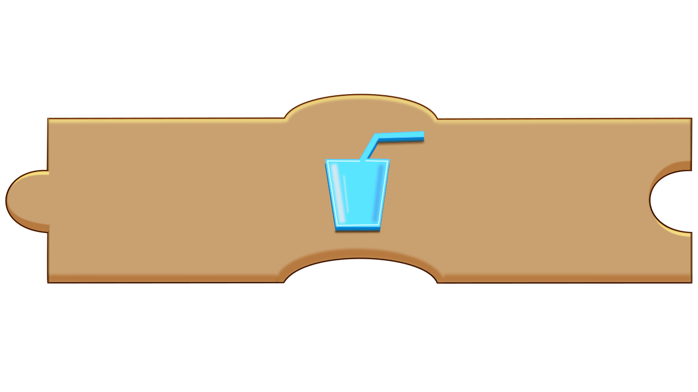
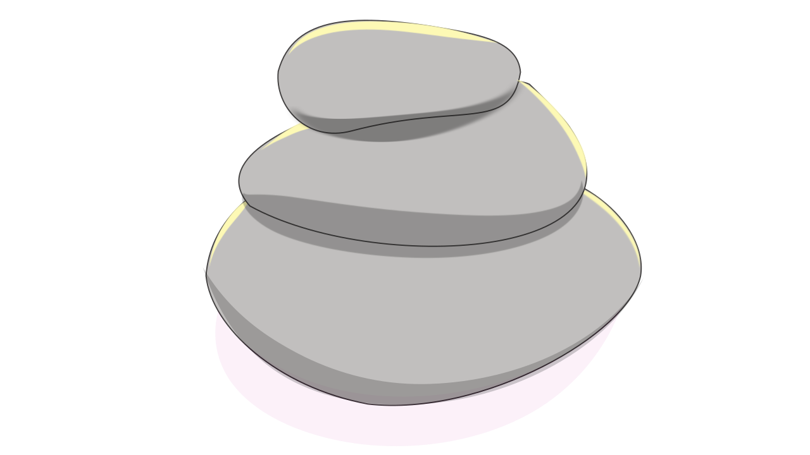
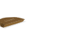
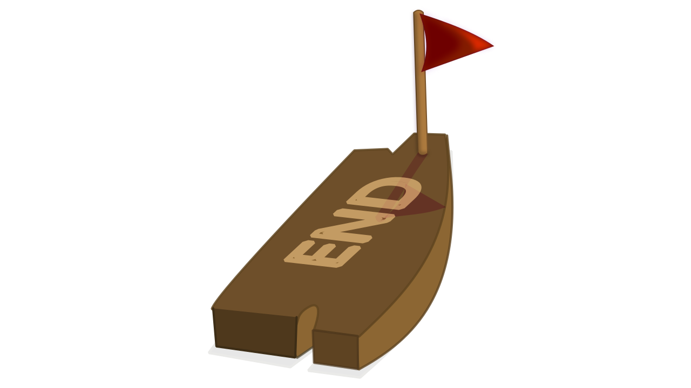

# Cock-a-doodle Challenge
Cock-a-doodle Challenge is a game designed to motivate children to reuse code through multiple time constrained programmable game elements. The programmable elements are chicks which appear on random tiles on a maze. The chicks may be programmed individually or collectively to get to the end of the maze.  

# Game Characters
The game has two game characters, chicks and a mother hen.
## Chicks
Chicks are the programmable. They have time assigned to them. In their default state, they are yellow, but when selected for programming, they change to another color.
<table>
  <tr>
    <td></td>
    <td></td>
  </tr>
  <tr>Figure 1. An unselected and selected chick </tr>
</table>

## Mother Hen
When tapped or clicked, the mother hen selects all the chicks and programs apply to all the chicks.
<table>
  <tr>
    <td></td>
  </tr>
  <tr>Figure 2. The mother hen </tr>
</table>

# Game Tiles
The game maze has different tile types described below:

## Food Tile
Food tiles have crumbs on them. Chicks may be programmed to eat the crumbs with an eat block.
<table>
  <tr>
    <td></td>
    <td></td>
  </tr>
  <tr>Figure 3. A food tile and block</tr>
</table>

## Water Tile
Chicks may be programmed to drink the water on this tile and gain more points.
<table>
  <tr>
    <td></td>
    <td></td>
  </tr>
  <tr>Figure 4. A water tile and block</figcaption>
</figure></tr>
</table>

## Walls
Chicks cannot walk over these tiles. They may only be programmed to go around them.
<table>
  <tr>
    <td></td>
  </tr>
  <tr>Figure 5. A wall tile</figcaption>
</figure></tr>
</table>

## Start Tile
This is the beginning of the maze. The mother hen appears next to this tile. Chicks may be programmed to go to this tile with the start block.

<table>
  <tr>
    <td></td>
    <td></td>
  </tr>
  <tr>Figure 6. A start tile and block</figcaption>
</figure></tr>
</table>

## Finish Tile
This tile is the end of the maze. Programming a chick to get to this tile means the chick can leave the maze.

<table>
  <tr>
    <td></td>
  </tr>
  <tr>Figure 7. The finish tile</figcaption>
</figure></tr>
</table>

## Open Tiles
Game characters may be programmed to pass through this tile, however additional points are not gained.

<table>
  <tr>
    <td></td>
  </tr>
  <tr>Figure 8. An open tile</figcaption>
</figure></tr>
</table>

# Game Levels
The game has multiple levels.
### Level 1
The goal in this level is to program a single chick to move from its current location to the finish tile. Tiles in this level include, start, open and finish tiles.
## Level 2
In this level chicks are to be programmed to get to the end tile, however, there are eat and drink tiles to gain additional points.
## Level 3
In addition to eat and drink tiles, walls are included to the maze.
## Level 4
This level has all the elements of level three, but this time they have to program three chicks and the mother hen character is included.
## Level 5
This level is the same as level 4 only there are eight game characters to program.